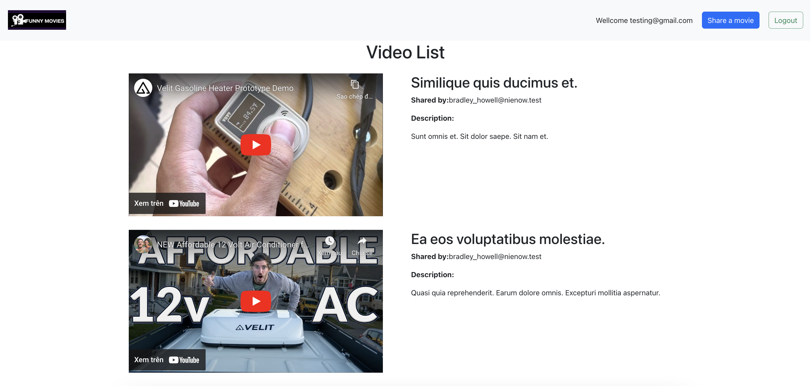

# Project Summary: YouTube Video Sharing Web App

## Introduction

This project aims to provide a platform for sharing YouTube videos in a collaborative environment. It is composed of a frontend and backend repository which together build a comprehensive web application.

The purpose of this web app is to offer users a streamlined, intuitive way to share their favorite YouTube videos with others. It encourages interaction and content discovery in a format that is easily accessible.

Key Features:

1. **User Registration and Login:** Users can easily register and manage their accounts using a secure registration and login system. If the email does not exist, the system will register a new user, if the email already exists, you must enter the correct password to log in.

2. **Sharing YouTube Videos:** Users can share YouTube videos on the platform, making them available for all other users.

3. **Viewing Shared Videos:** The platform maintains a list of all shared videos. This list can be viewed by any user, enhancing the community experience.

4. **Real-time Notifications:** The application incorporates a real-time notification system using Firebase Realtime Database. Whenever a new video is shared, all logged-in users receive a notification. This feature ensures users are up-to-date with the latest content on the platform.

The project is developed using a React and TypeScript frontend, and a Ruby on Rails backend, with real-time notifications via Firebase's Realtime Database, and background job handling via Sidekiq and Redis.

Deployment is managed using Docker, with Docker images stored on AWS's Elastic Container Registry (ECR), and container orchestration handled by AWS Elastic Container Service (ECS).

The project employs a GitHub and AWS CodePipeline CI/CD pipeline for auto-deployments. On each GitHub push, CodePipeline triggers a CodeBuild process, creating Docker images for storage in ECR. Upon successful build, CodeDeploy updates the ECS services with the new Docker images, providing a streamlined and robust development-to-deployment workflow.

This application is developed following best practices for modern web application development.

Refer to the individual repositories for more specific details regarding each component of the web application:

1. [Demo Website](https://video-sharing.dubbing.co)
2. [Backend Repository](https://github.com/tnkttruong/video_sharing_BE)
3. [Frontend Repository](https://github.com/tnkttruong/video_sharing_FE)

